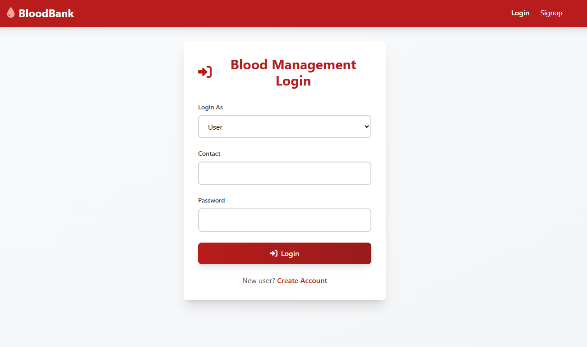
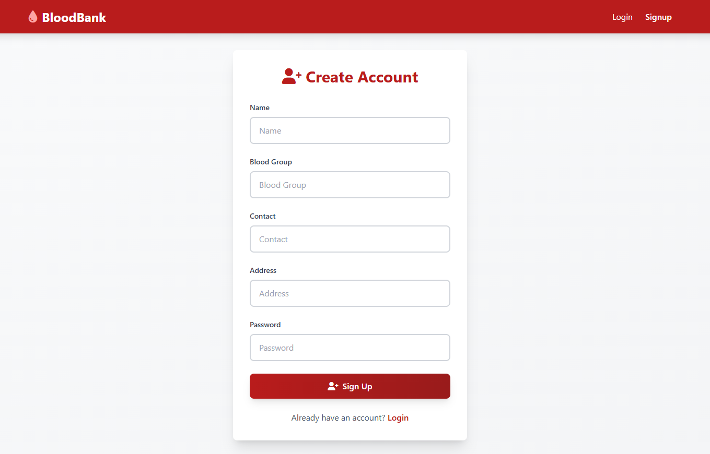
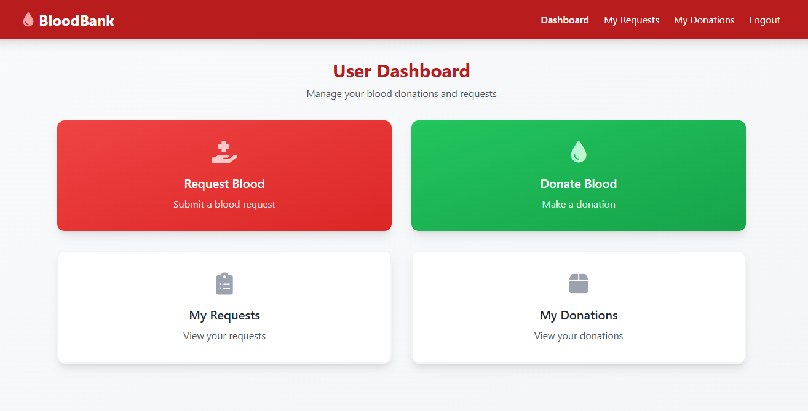
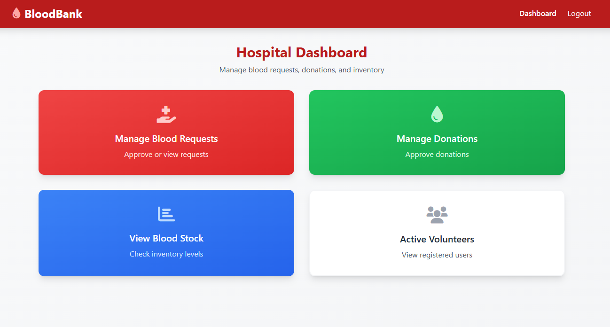
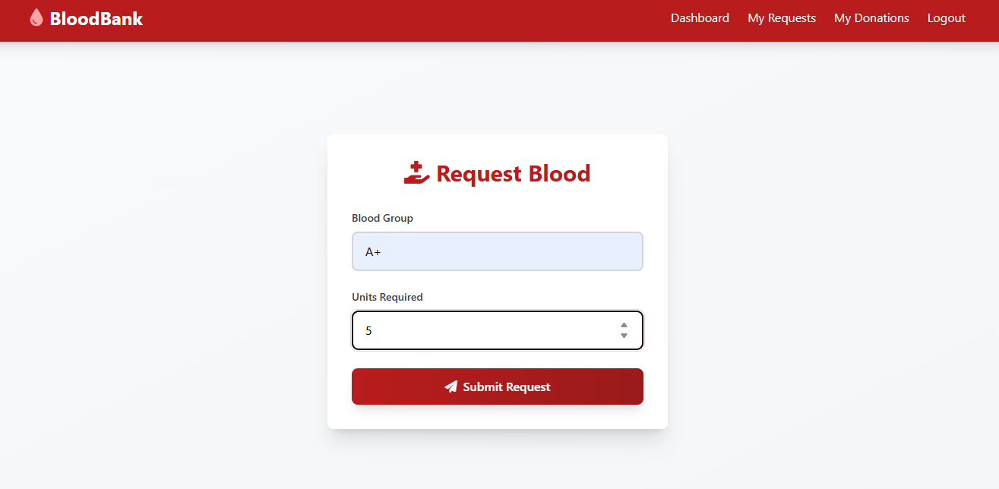
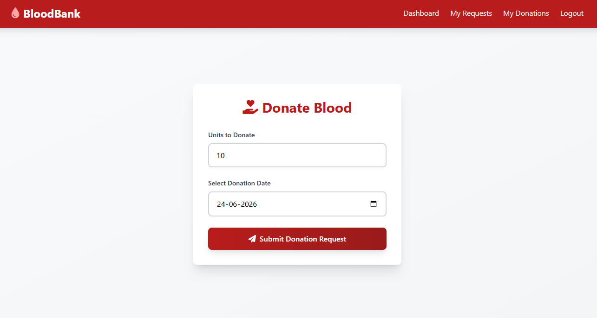
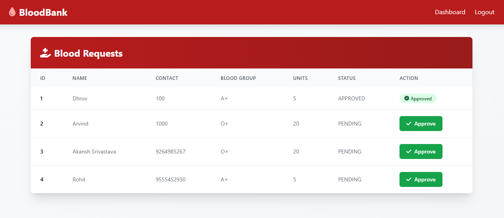
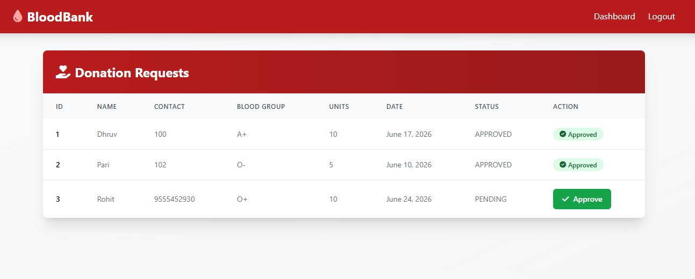
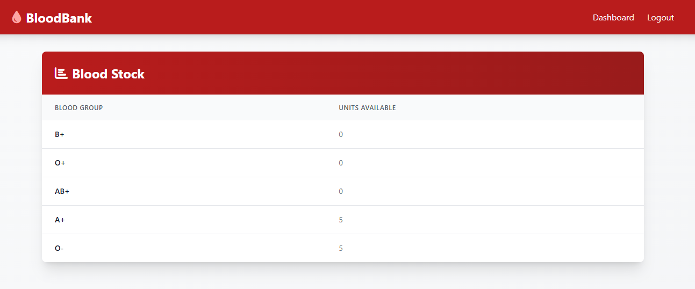

# 🩸 Blood Donation & Management System

A full-stack Blood Donation & Management System built with **Django**, **PostgreSQL**, **Tailwind CSS**, and **JavaScript**. The system enables users to donate blood, request blood, and allows hospitals to manage requests, donations, and blood inventory efficiently.

## 🌐 Live Demo

**Website:** https://web-production-bee26.up.railway.app/

---

## ✨ Features

### 👤 User Features

* User Registration & Login
* Donate Blood
* Request Blood
* View Donation History
* Track Request Status
* User Dashboard

### 🏥 Hospital Features

* Hospital Login
* Manage Blood Requests
* Manage Donations
* View Blood Stock
* View Registered Users
* Inventory Management

### 🗄 Database Features

* PostgreSQL Database
* Normalized Database Design (3NF)
* Foreign Key Constraints
* Triggers & Stored Procedures
* Automated Blood Stock Updates
* Secure Transaction Management

---

## 🛠 Tech Stack

| Category   | Technology                      |
| ---------- | ------------------------------- |
| Backend    | Django                          |
| Database   | PostgreSQL                      |
| Frontend   | HTML5, Tailwind CSS, JavaScript |
| Icons      | Font Awesome                    |
| Deployment | Railway                         |

---

## 📷 Screenshots

<h3>Login & Signup</h3>

<p align="center">
  
  
</p>

<h3>User & Hospital Dashboard</h3>

<p align="center">
  
  
</p>

<h3>Blood Request & Donation</h3>

<p align="center">
  
  
</p>

<h3>Management Panels</h3>

<p align="center">
  
  
</p>

<h3>Blood Stock Dashboard</h3>

<p align="center">
  
</p>

---

## 🏗 System Architecture

```text
Frontend (HTML + Tailwind CSS + JavaScript)
                    │
                    ▼
              Django Backend
                    │
                    ▼
            PostgreSQL Database
                    │
                    ▼
      Procedures, Triggers & Views
```

---

## 📊 Database Modules

* USERS
* HOSPITAL
* BLOOD_DONATION
* BLOOD_REQUEST
* BLOOD_STOCK

---

## 🚀 Installation

### Clone Repository

```bash
git clone https://github.com/your-username/your-repository.git
cd your-repository
```

### Create Virtual Environment

```bash
python -m venv venv
```

### Activate Environment

**Windows**

```bash
venv\Scripts\activate
```

**Linux / Mac**

```bash
source venv/bin/activate
```

### Install Dependencies

```bash
pip install -r requirements.txt
```

### Run Migrations

```bash
python manage.py makemigrations
python manage.py migrate
```

### Start Development Server

```bash
python manage.py runserver
```

Open:

```text
http://127.0.0.1:8000/
```

---

## 🔄 Workflow

1. User registers and logs in.
2. User submits blood donation or blood request.
3. Hospital reviews requests and donations.
4. Blood stock is updated automatically.
5. Requests are processed based on stock availability.

---

## 🔮 Future Enhancements

* Email Notifications
* SMS Alerts
* Mobile Application
* Emergency Blood Matching
* Analytics Dashboard
* Location-Based Donor Search

---

## 👨‍💻 Authors

* Dhruv Dwivedi
* Pratham Nandwani

---

## 📄 License

This project is for educational and academic purposes.
